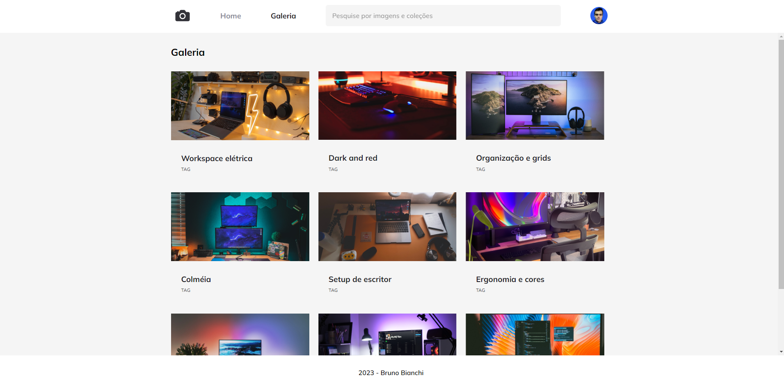

<h1 align="center"> Desafio FotoBlog - Criando uma galeria de fotos com recurso grid</h1>

Programa exclusivo do Bruno Bianchi, para ensino de tecnologias WEB.  
Desafio proposto pela Rocketseat, com objetivo de criar uma galeria de fotos utilizando o recurso de grid. 

  <a href="#-tecnologias">Tecnologias</a>&nbsp;&nbsp;&nbsp;|&nbsp;&nbsp;&nbsp;
  <a href="#-projeto">Projeto</a>

  

  

 

## 🚀 Tecnologias

Esse projeto foi desenvolvido com as seguintes tecnologias:

- HTML e CSS
- Git e Github

## 💻 Projeto

O Desafio é criar uma galeria de fotos utilizando o recurso de grid.

- [Acesse o projeto finalizado, online](https://brunobianchi13.github.io/Desafio-FotoBlog/)
- [Acesse o Layout no Figma](https://www.figma.com/file/C3gDsI68zP425fa3KUwqVC/Fotoblog-%E2%80%A2-Projeto-Explorer-(Community)?node-id=0%3A1&mode=dev)

---

Feito by Bruno Bianchi

